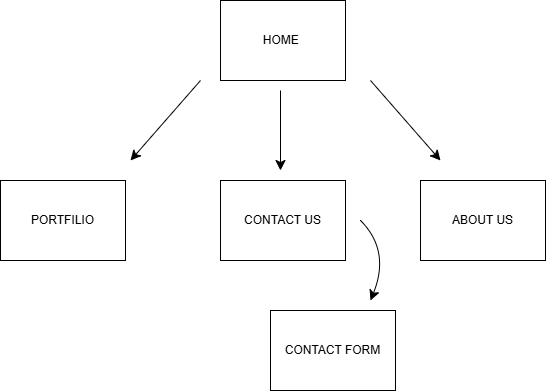

# Project Title
POE WEDE-5020 ( J15 INTERIOR DESIGN )

## Student Information
**Student number:** (ST1051704)  
**Student Name:** Phuti Robert Masehela

## Project Overview

j15 five is an interior design company founded in 2021. Our founder started with her first home, from which the desire to pursue further led to paying clients. J15 focuses on creating warm, inviting, and exquisite interior spaces that are also practical for everyday living.

The Mission of her organisation “To design refined, functional interior spaces that blend simplicity, elegance, and comfort, while delivering personalized experiences that reflect each client’s lifestyle and vision.”

My project is based on J15 interior design which is an independent business.
## Website Goals and Objectives

GOALS
The main goals of J15 Interiors website are to:
•	Build a strong online presence for the company.
•	Showcase completed interior design projects and services. 
•	Attract new residential and commercial clients. 
•	Make it easy for customers to contract the business and request quotations.
OBJECTIVES
To achieve these goals the website should:
•	Providing clear information about the services offered 
•	Include enquiry form for efficient communication.
•	Be friendly and easy to navigate. 
•	Reflects the company’s values. 

## Timeline and Milestones

•	7 April 2026 I enquired to the J15 owner about their business and asked permission on doing a website for them. 
•	10 April 2026 – 12 April 2026 I conducted research on various websites which were related to interior designing websites such as ( (Studio McGee, 2014) )
•	10 – 12 April 2026 Began designing a Figma wireframe for the website so I could have a basic overview of how I want the design to look 
•	15 – 19 April 2026 I began to code the HTML layout of the website 
•	20 April 2026 Submission Day  

## Sitemap

   (THIS IS MY SITEMAP)

## References
References
Gibson, C. K., Newton, D. J., & Cochran, D. S. (1992). Mission statement. Retrieved 2026, from Wikipedia: Mission statement - Wikipedia
Studio McGee. (2014). Beautiful interior Design and Home Decor. Retrieved from Studio McGee: Studio McGee: Beautiful Interior Design & Home Decor

Figure 1: A diagram showing how KPIs	2

